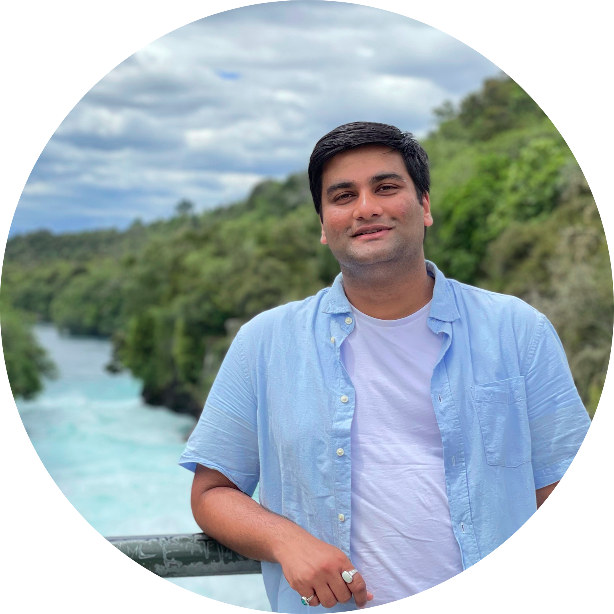

---
# Feel free to add content and custom Front Matter to this file.
# To modify the layout, see https://jekyllrb.com/docs/themes/#overriding-theme-defaults

layout: home
---

Hi! I am Duttatrey.

I am a mathematics PhD student at the [University of Canterbury]("http://www.canterbury.ac.nz"), where I am funded by a PhD scholarship from the Marsden Grant.

Before coming to Christchurch, I completed my B.Sc. and M.Sc. in Mathematics from [UM-DAE CEBS, Mumbai](www.cbs.ac.in) in 2017.

My (mathematical) interests are in number theory, algebraic and arithmetic geometry. I employ computational tools to support my theoretical exploits.
